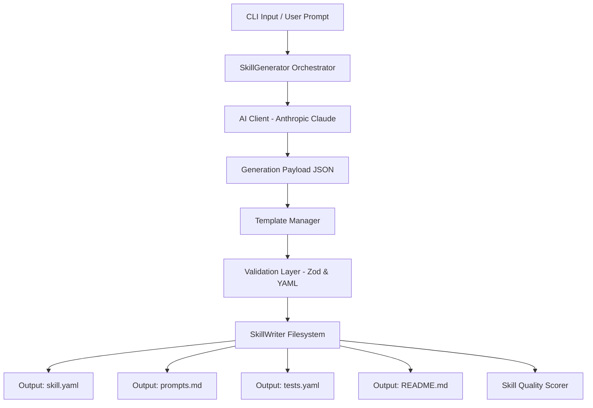

# AMRIT Skill Generation Architecture

Here is the architectural data flow diagram illustrating the end-to-end scaffolding process.

## Component Responsibilities
1. **CLI / Input Manager**: Collects natural language requests (or enters interactive prompting).
2. **SkillGenerator**: Coordinates compilation phases, replacements mapping, and verification.
3. **AI Client**: Communicates with Anthropic models to synthesize capability structures, test inputs, and documentation sections.
4. **Template Manager**: Interleaves scaffolding structures with the AI responses.
5. **Validation Layer**: Rejects outputs that violate semantic formatting or test sizing limits.
6. **Skill Quality Scorer**: Audits output directories to calculate an operational score (0-100).
